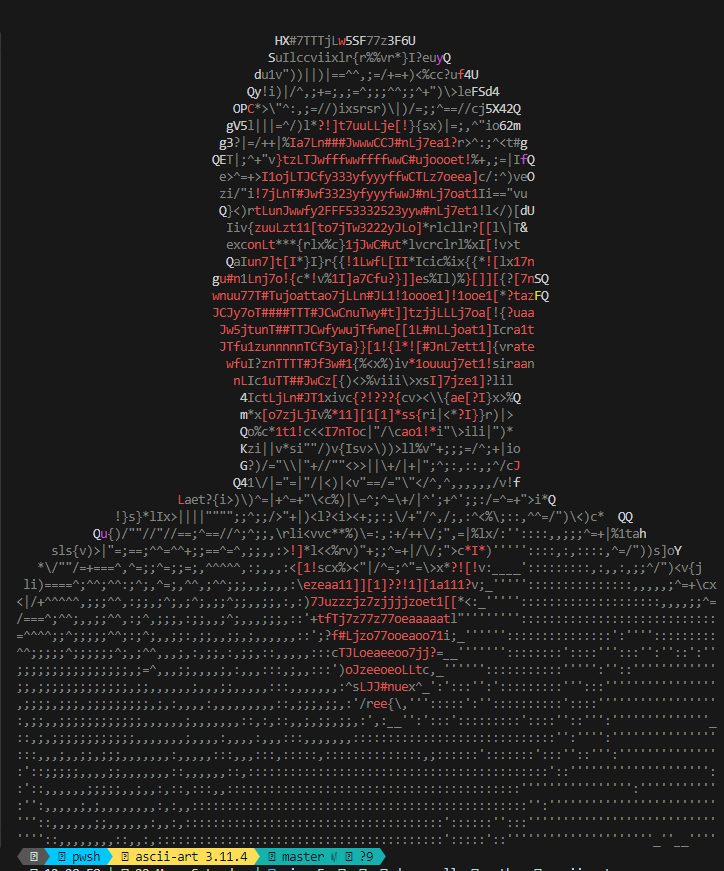

## Hi 👋, I'm Marlon Ortega

A passionate developer

<h3> 🛠 &nbsp;Tech Stack</h3>

- 💻 &nbsp;
  
  
  
  
  
  
  
- 🌐 &nbsp;
  
  
  
  
  
  
  
  
  
- 🛢 &nbsp;
  
  
  
  
    
- ⚙️ &nbsp;
  
  
  
  
- 🔧 &nbsp;
  
  
  
  
  
  

 
